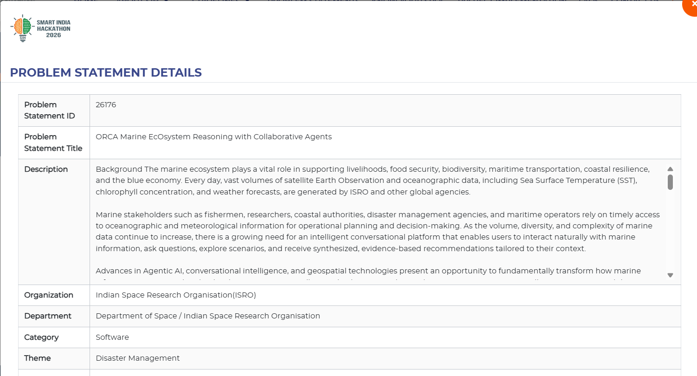

# Oceanix

Oceanix is a frontend prototype for an agentic ocean-intelligence platform focused on safer, more productive fishing operations in the Indian Ocean. It presents satellite-informed marine conditions, potential fishing zones (PFZs), maritime-boundary awareness, and explainable multi-agent reasoning in one decision workspace.

The current experience is branded as **Blue Orbit** and was created by **Team Runtime Terror** for Smart India Hackathon 2026.




## Project running state

**Current state: runnable frontend prototype.** The Vite development server starts the React application locally, and all five routes are available through the top navigation:

- Home page with interactive animated background
- AI Decision Studio with simulated DAG execution and browser text-to-speech
- GIS Command Map with Leaflet tiles, toggled layers, and route simulation
- Safety Barometer with static safety and satellite-feed indicators
- Advisory Bulletin with browser print/export support

The interface is usable end to end with demo data, but it is not connected to live ocean, weather, vessel, border, AI, or cloud services. The simulated controls and displayed measurements should not be used for real navigation or fishing decisions.

## What is included

- **AI Decision Studio**: submit a marine query and inspect a synthesized advisory alongside its five-step agent provenance chain.
- **GIS Command Map**: view PFZ and IMBL layers, simulate a trawler route, and see a proximity notification.
- **Safety Barometer**: review the Kochi fishing-harbour safety index, marine conditions, and satellite-feed health cards.
- **Advisory Bulletin**: view a printable marine advisory with PFZ coordinates, confidence values, and IMBL compliance guidance.
- **Responsive interface**: React Router navigation, Framer Motion transitions, Tailwind CSS styling, and Leaflet map views.

## Technology

- React 19 and React DOM
- Vite 8
- React Router
- Tailwind CSS 4
- Framer Motion
- React Leaflet and Leaflet
- Lucide React icons

## Project structure

```text
oceanix/
├── README.md
├── package.json                 # Workspace-level dependency reference
└── oceanix-frontend/
	├── package.json             # Frontend scripts and dependencies
	├── index.html
	├── vite.config.js
	├── public/
	└── src/
		├── App.jsx              # Navigation and application routes
		├── index.css            # Tailwind theme and shared styles
		├── components/
		│   └── InteractiveMesh.jsx
		└── pages/
			├── AdvisoryBulletin.jsx
			├── AgenticChat.jsx
			├── GISMap.jsx
			└── SafetyBarometer.jsx
```

Module	Concepts / Technologies	How it is used
1. Marine Data Processing --> Satellite Data, Remote Sensing, Data Preprocessing	---> Collect and process SST, chlorophyll, wind, waves, currents, weather, PFZ, cyclone and boundary data.
2. Multi-Agent AI --->	Multi-Agent Systems, LLM, Agent Collaboration	Ocean Agent, ---> Weather Agent and Geo Agent analyze different aspects of the user's query and share their results.
3. GIS & Spatial Analysis --> GIS, Haversine Distance, Geofencing ---> Locate PFZs, vessels, IMBL/MPA boundaries and hazards, and calculate proximity/route violations.
4. Risk & Safety Assessment ---> Rule-Based Reasoning, Weighted Risk, Safety Score ---> Combines ocean, weather and spatial information to calculate risk and Safety Index.
5. Explainable Decision Support ---> Reasoning Engine, Explainable AI, Advisory Generation ---> Combines agent outputs and evidence to generate an explainable marine advisory/recommendation.

## Requirements

- Node.js 20 or newer
- npm 10 or newer
- Internet access for Leaflet base-map tiles and the demo vessel icon

## Getting started

From the repository root:

```bash
cd oceanix-frontend
npm install
npm run dev
```

Open the local URL printed by Vite, usually `http://localhost:5173`.

## Available scripts

Run these commands from `oceanix-frontend/`:

```bash
npm run dev       # Start the Vite development server
npm run build     # Create a production build in dist/
npm run preview   # Serve the production build locally
npm run lint      # Run ESLint
```

## Routes

| Path | View | Purpose |
| --- | --- | --- |
| `/` | Home | Platform overview and launch actions |
| `/chat` | AI Decision Studio | Marine query input, synthesized advisory, and provenance chain |
| `/gis` | GIS Command Map | PFZ/IMBL map layers and route simulation |
| `/safety` | Safety Barometer | Safety score, sea conditions, and data-feed health |
| `/bulletin` | Advisory Bulletin | Printable/exportable marine advisory |

## Demo scope and data

This repository currently contains a UI prototype. The values shown in the advisory, map, and safety views are static demonstration data, and the agent execution sequence is simulated in the browser. No live ISRO, INCOIS, weather, vessel-tracking, authentication, or cloud-storage API is configured yet.

The map uses CARTO tiles through Leaflet. A production integration should replace the static values with verified services, add error/loading states, protect operational APIs, and validate all safety directives before they are distributed to users.

## Production build

```bash
cd oceanix-frontend
npm run build
npm run preview
```

The generated assets are written to `oceanix-frontend/dist/`. Configure the hosting platform to serve `index.html` as the fallback for client-side routes.

## Contributing

1. Create a focused branch for your change.
2. Install dependencies with `npm install` inside `oceanix-frontend/`.
3. Run `npm run lint` and `npm run build` before opening a pull request.
4. Describe any changes to marine-data assumptions, external services, or safety-related behavior.

## License

See [LICENSE](LICENSE).
